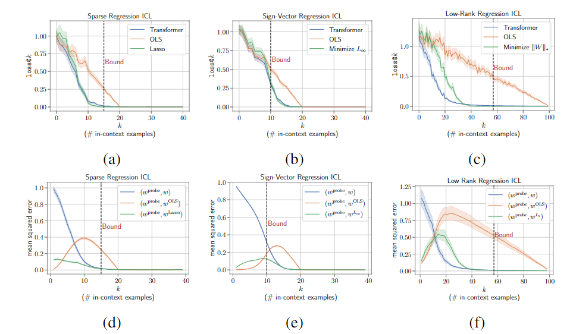
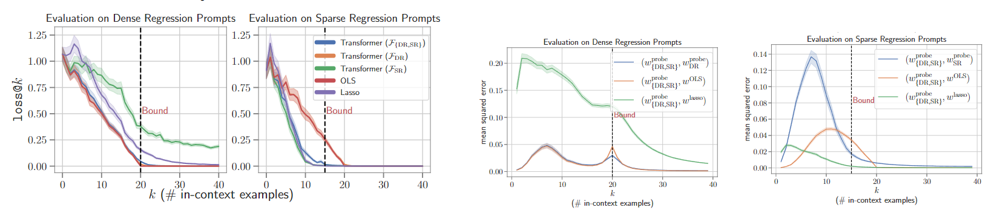

This repository contains the code and models for our paper:

**In-Context Learning through Bayesian Prism** <br>




Code adapted from [https://github.com/dtsip/in-context-learning](https://github.com/dtsip/in-context-learning):

```bibtex
    @InProceedings{garg2022what,
        title={What Can Transformers Learn In-Context? A Case Study of Simple Function Classes},
        author={Shivam Garg and Dimitris Tsipras and Percy Liang and Gregory Valiant},
        year={2022},
        booktitle={arXiv preprint}
    }
```

## Getting started
You can start by cloning our repository and following the steps below.

1. Install the dependencies for our code using Conda. You may need to adjust the environment YAML file depending on your setup.

    ```
    conda env create -f environment.yml
    conda activate in-context-learning
    ```

2. [Optional] If you plan to train, populate `conf/wandb.yaml` with you wandb info.


## Reproducing Experiments in the Paper

The code for all the experiments is contained in [`src/`](src/) directory. Swith that to the working directory to run experiments.

```bash
cd src
```

### Linear inverse problems

To train models on **Dense Regression (DR)** function class run:

```bash
python train.py --config conf/linear_regression.yaml
```

To train models on **Sparse Regression (SR)** function class run:

```bash
python train.py --config conf/sparse_regression.yaml
```

To train models on **Sign-Vector Regression (SVR)** function class run:

```bash
python train.py --config conf/sign_vec_cs.yaml
```

To train models on **Low-Rank Regression** function class run:

```bash
python train.py --config conf/low_rank_cs.yaml
```

### Non-linear functions

For **Fourier Series**, run the following:

```bash
python train.py --config conf/fourier_series.yaml

```
To evaluate inductive biases using the **DFT method** after training the model, run:

```bash
python fourier_series_inductive_bias.py <RUN_ID_Of_TrainedModel> <MaxFreq> interpolate Transformer True
```

For **Monomial Regression**, run the following:
```bash
python train.py --config conf/polynomials_deg2_monomials_fixed_S.yaml
```

For **HAAR Wavelets**, run the following:
```bash
python train.py --config conf/haar_wavelets.yaml
```

### Task Mixtures

For **DR + SR** mixture:
```bash
python train.py --config conf/lr_sr.yaml
```

For **DR + SVR** mixture:
```bash
python train.py --config conf/lr_sign_vec_cs_mixer.yaml
```

For **DR + SR + SVR** mixture:
```bash
python train.py --config conf/lr_sr_sign_vec_cs_mixer.yaml
```

For **DR + DT** mixture:
```bash
python train.py --config conf/lr_dt.yaml
```

For **DT + NN** mixture:
```bash
python train.py --config conf/dt_relu_2nn_mixer.yaml
```

For **Fourier Series Mixtures** (simplicity bias) run:
```bash
python train.py --config conf/fourier_series_simpl.yaml
```
The DFT analysis can be performed similarly as for the single fourier experiment as above by running:

```bash
python fourier_series_mixture_inductive_bias.py <RUN_ID_Of_TrainedModel> <MaxFreq> interpolate Transformer True
```

For **GMM** experiments run:
```bash
python train.py --config conf/gmm_linear_regression.yaml
```


### Evaluations
For evaluation on different tasks, refer to the notebooks provided in [EvalNotebooks/](EvalNotebooks/)